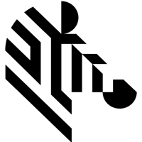

<!-- PROJECT LOGO -->
<br />
<p align="center">
  <a href="https://github.com/ZebraDevs/React_Native_Zebra_Mobile_Dimensioning">
    
  </a>
</p>


# react-native-zebra-mobile-dimensioning

Zebra Mobile Dimensioning

## Installation

```sh
npm install react-native-zebra-mobile-dimensioning
```

## Usage


```js
import { EnableDimension, GetDimension, DisableDimension, GetDimensionParameters, SetDimensionParameters } from 'react-native-zebra-mobile-dimensioning';

// ...

EnableDimension({ MODULE: 'parcel' });
```


## Contributing

See the [contributing guide](CONTRIBUTING.md) to learn how to contribute to the repository and the development workflow.

## License

Underlying code generated by create-react-native-library is under [MIT license](LICENSE)  
Zebra modifications to support Mobile Dimensioning are under [DEVELOPMENT TOOL LICENSE AGREEMENT](LICENSE.md)

---

Made with [create-react-native-library](https://github.com/callstack/react-native-builder-bob)
